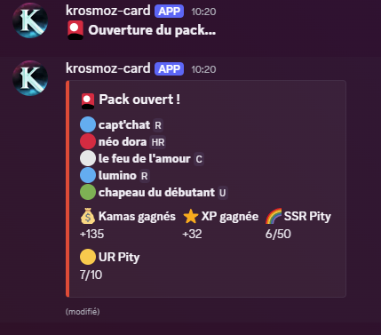
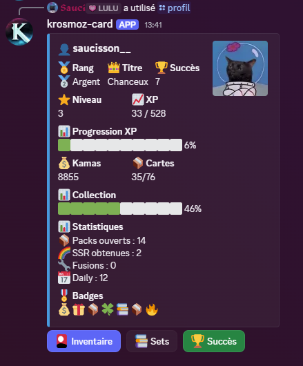
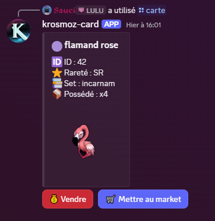
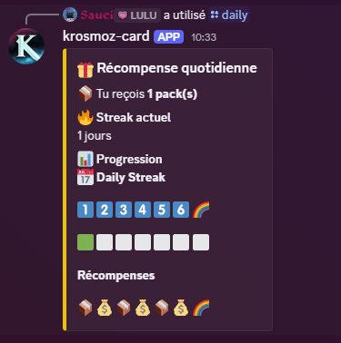
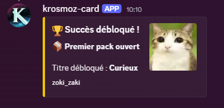

# 🎴 Krosmoz Card Bot

**Krosmoz Card Bot** est un bot Discord implémentant un **jeu de collection de cartes (TCG)** inspiré de l'univers **Krosmoz (Wakfu / Dofus)**.

Les joueurs peuvent :

* ouvrir des **packs**
* collectionner des **cartes**
* gagner des **kamas**
* compléter des **sets**
* faire des **échanges**
* vendre des cartes sur un **marché**
* débloquer des **succès**
* progresser en **niveau et rang**

Le bot est conçu avec une **architecture modulaire Node.js** afin de faciliter les ajouts de contenu et de fonctionnalités.

---

# ⚙️ Technologies utilisées

* **Node.js**
* **discord.js v14**
* **JSON Database**
* **Canvas** (images inventaire)
* Architecture modulaire (`systems/`)

---

# 📂 Structure du projet

```
krosmoz-card-bot
│
├ commands
│ ├ joueur
│ ├ admin
│ └ dev
│
├ systems
│
├ cards
│ ├ images
│ ├ cards.json
│ └ sets.json
│
├ database
│ ├ users.json
│ ├ market.json
│ ├ devs.json
│ └ config.json
│
├ index.js
├ deployCommands.js
├ package.json
└ README.md
```

---

# 🧠 Architecture

Le bot est divisé en **systèmes indépendants** :

| système           | rôle                          |
| ----------------- | ----------------------------- |
| achievementSystem | gestion des succès            |
| achievementCheck  | vérification des achievements |
| antiAbuse         | prévention du farm abusif     |
| auditSystem       | logs développeur              |
| dailySystem       | récompenses quotidiennes      |
| economy           | gestion des kamas             |
| eventSystem       | événements                    |
| inventoryImage    | génération image inventaire   |
| market            | marché des cartes             |
| pack              | génération des packs          |
| progressionSystem | niveau et XP                  |
| rankSystem        | rangs                         |
| rewards           | récompenses                   |
| setSystem         | sets et collections           |
| tradeSystem       | échanges joueurs              |
| usersystem        | gestion base utilisateurs     |

---

# 🧾 Base de données

Le bot utilise une **database JSON locale**.

### users.json

Stocke :

* inventaire cartes
* kamas
* achievements
* niveau
* xp
* statistiques

### market.json

Stocke :

* annonces du marché
* vendeur
* prix
* carte

---

# 🎴 Cartes

Les cartes sont définies dans :

```
cards/cards.json
```

Structure :

```json
{
 "id": 1,
 "name": "Cra",
 "rarity": "C",
 "set": "incarnam",
 "image": "1_cra_incarnam_c.jpg"
}
```

---

# ⭐ Raretés

| Rarete | Emoji |
| ------ | ----- |
| C      | ⚪     |
| U      | 🟢    |
| R      | 🔵    |
| SR     | 🟣    |
| HR     | 🔴    |
| UR     | 🟡    |
| S      | ✨     |
| SSR    | 🌈    |

---

# 🎮 Commandes Joueur

## Packs

```
/krosmoz
/buypack
/pity
```

## Inventaire

```
/inventaire
/carte
/listcards
```

## Économie

```
/balance
/sellcard
/sellall
/sellduplicate
```

## Marché

```
/market
```

Fonctionnalités :

* achat
* vente
* tri
* filtres
* pagination

---

## Collection

```
/set
/sets
```

---

## Progression

```
/profil
/leaderboard
/titre
```

---

## Gameplay

```
/daily
/fusion
/trade
```

---

## Succès

```
/achievement
```

---

## Aide

```
/kroshelp
```

---

# 🛠 Commandes Admin

```
/event
/stats
```

---

# ⚙️ Commandes Développeur

```
/devhelp
/addcard
/editcard
/removecard
/importcards
/devpack
/devgive
/devachievement
/devdaily
/cooldown
/resetcooldown
/resetpity
/hardpity
/simpack
/previewcard
/krosmodev
/krosmoreload
```

Gestion des sets :

```
/setcreate
/setedit
/setdelete
/setreward
/setstats
/setlist
```

---

# 🪙 Économie

Monnaie utilisée :

**Kamas**

Sources :

* packs
* daily
* ventes
* événements
* récompenses

---

# 📈 Progression

Les joueurs gagnent :

* **XP**
* **niveaux**
* **rangs**
* **badges**

Affichés dans :

```
/profil
```

---

# 🏆 Achievements

Le bot possède un système de **succès automatiques** :

Exemples :

* ouvrir X packs
* obtenir SSR
* compléter un set
* utiliser le marché

---

# 🧩 Fonctionnalités principales

✔ système de **packs gacha**
✔ **inventaire paginé**
✔ **marché entre joueurs**
✔ **échanges sécurisés**
✔ **système de sets**
✔ **fusion de cartes**
✔ **succès automatiques**
✔ **progression et rangs**
✔ **economy avec kamas**
✔ **interface Discord interactive**

---

# 🚀 Installation

### 1️⃣ Cloner le repo

```
git clone https://github.com/saucissonYT/krosmoz-card-bot.git
```

---

### 2️⃣ Installer les dépendances

```
npm install
```

---

### 3️⃣ Créer `.env`

```
TOKEN=discord_token
CLIENT_ID=discord_client_id
```

---

### 4️⃣ Déployer les commandes

```
node deployCommands.js
```

---

### 5️⃣ Lancer le bot

```
node index.js
```

---

# 🔒 Sécurité

Le fichier `.env` est ignoré via `.gitignore`.

Ne jamais publier :

```
.env
node_modules
database/users.json
database/market.json
```

---

# 🛣 Roadmap

Fonctionnalités prévues :

* 🔥 nouveaux sets
* 🏹 events temporaires
* 📊 statistiques avancées

---

# 👨‍💻 Auteur

Projet créé par :

 sauci 

---

## 📸 Screenshots

### 🎴 Ouverture de pack


### 👤 Profil joueur


### 🎴 Carte


### 🎁 Daily reward


### 🏆 Succès



---

# 📜 Licence

Rédaction
📜 Licence

Ce projet est distribué comme projet open-source non commercial.

Krosmoz Card Bot est un projet fan non officiel inspiré de l’univers Krosmoz (Dofus / Wakfu).

Tous les droits relatifs à l’univers, aux personnages, aux noms et aux visuels appartiennent à Ankama.

Ce projet :

n’est pas affilié à Ankama

n’est pas approuvé par Ankama

est développé uniquement à des fins communautaires et éducatives

Le bot est entièrement gratuit et ne génère aucun revenu.

Si Ankama demande la modification ou la suppression de certains contenus, ils seront retirés du projet (et il sera adapté à un autre univers).

---
