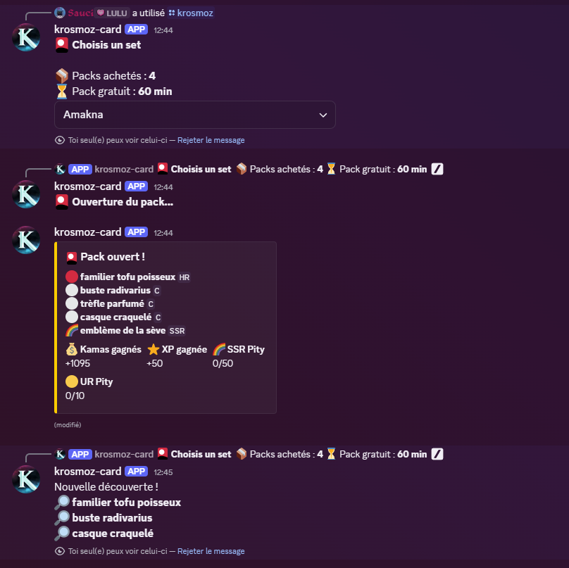
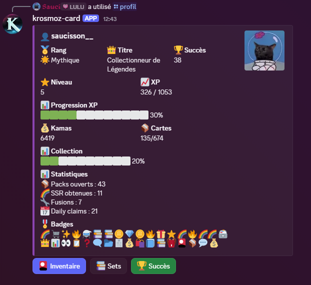
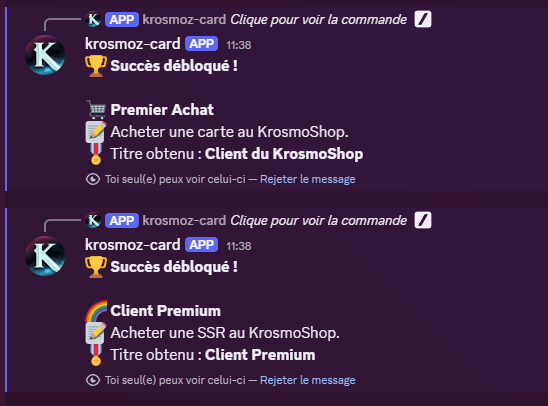
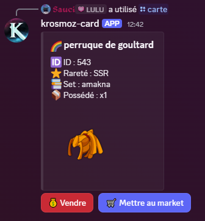
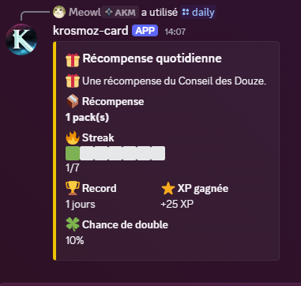
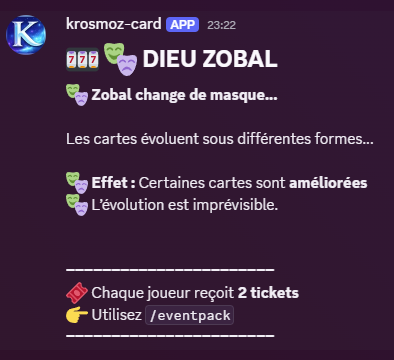
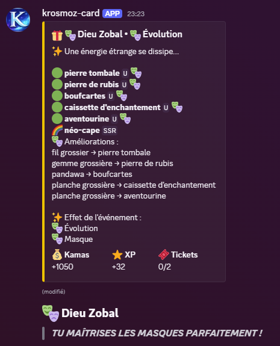
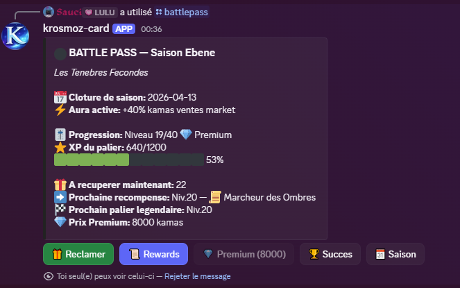
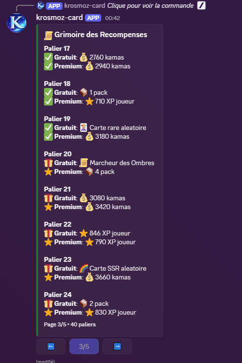
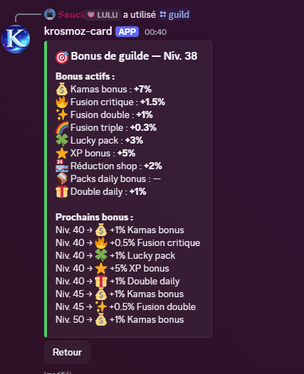

# 🎴 Krosmoz Card Bot

Krosmoz Card Bot est un bot Discord implémentant un jeu de collection de cartes (TCG) inspiré de l'univers Krosmoz (Wakfu / Dofus).

Les joueurs peuvent :

- Ouvrir des packs et collectionner 2349 cartes
- Compléter 7 sets (Incarnam, Astrub, Amakna, Sufokia, Kelba, Katrepat, Sberg)
- Fusionner des doublons pour monter en rareté
- Collecter des **fragments** de cartes SSR et les assembler via `/craft`
- Vendre et acheter sur le marché entre joueurs
- Tenter sa chance à la **Roulette d'Ecaflip** une fois par heure (31 lots, jackpot secret)
- Participer aux événements des 19 Dieux du Krosmoz
- Réagir aux **Piñatas d'Ecaflip** — event communautaire avec récompenses par palier
- Acheter des cartes au KrosmoShop quotidien
- Compléter des quêtes journalières et hebdomadaires
- Créer ou rejoindre une guilde et profiter de bonus collectifs
- Donner des cartes à d'autres joueurs
- Progresser jusqu'au niveau 200 et débloquer des bonus permanents
- Débloquer 579 succès, badges et titres exclusifs
- Interagir avec le bot via mentions

---

## Version Site (Web)

Le projet inclut aussi une version site complete (Express + front web) :

- Interface locale pour inventaire, cartes, marche, quetes, battle pass, evenements, guildes, profil et classement
- Simulation de connexion locale pour tester rapidement sans push
- Les actions site et Discord partagent les memes donnees (utilisateur, inventaire, progression, succes)

---

## ⚙️Technologies

- Node.js
- discord.js v14
- SQLite via better-sqlite3 (users, market, guilds, battlepass progress)
- JSON (fichiers de config statiques : cards, devs, season templates)
- Canvas (images inventaire)
- Sharp (traitement d'images cartes)
- Express (API web / webhooks)
- Architecture modulaire (systems/)

---

## 📂 Structure du projet

```txt
krosmoz-card
|
|-- commands/
|   |-- joueur/              # commandes joueur (krosmoz, fusion, market, battlepass, roulette...)
|   |-- admin/               # commandes admin
|   `-- dev/                 # commandes dev (devbp, devguild, simpack, devroulette...)
|
|-- systems/
|   |-- achievements/        # modules de succès
|   |-- eventHandlers/       # handlers d'events (1 par Dieu)
|   |-- database.js          # couche SQLite (better-sqlite3, WAL, prepared statements)
|   |-- migrate.js           # migration automatique JSON → SQLite
|   |-- battlePassService.js # logique Battle Pass (XP, paliers, claims)
|   |-- seasonService.js     # saisons (rotation, templates, rewards)
|   |-- guildSystem.js       # guildes (CRUD, XP, niveaux)
|   |-- guildQuestSystem.js  # quêtes de guilde (5 journa + 5 hebdo, scaling)
|   |-- fragmentService.js   # logique fragments (drop, craft, index, progress)
|   `-- ...                  # pack, market, user, progression, etc.
|
|-- config/
|   `-- battlepassXP.json    # sources d'XP Battle Pass
|
|-- cron/
|   `-- seasonReset.js       # reset automatique des saisons
|
|-- cards/
|   |-- images/
|   |-- import/
|   `-- sets.json
|
|-- data/
|   |-- krosmoz.db           # base SQLite (users, market, guilds, battlepass)
|   |-- cards.json           # définitions des cartes (config statique)
|   |-- devs.json            # liste des devs (config statique)
|   `-- battlepass/
|       |-- current_season.json
|       `-- seasons/          # templates de saisons
|
|-- index.js
|-- CHANGELOG.md
`-- README.md
```

---

## 🧠 Architecture

Le bot utilise une architecture modulaire basée sur des systèmes indépendants.

### ⚙¸ Systèmes principaux

| Système | Rôle |
|---------|------|
| database | Couche SQLite (better-sqlite3, WAL mode, prepared statements, leaderboard SQL) |
| dataManager | Cache mémoire + autosave 30s vers SQLite |
| userSystem | Gestion des utilisateurs (cache + SQLite) |
| cardRegistry | Indexation dynamique des cartes |
| constants | Constantes centralisées (raretés, prix, couleurs, PACK_PRICE, MAX_PLAYER_LEVEL) |

### 🎮 Gameplay

| Système | Rôle |
|---------|------|
| pack | Génération RNG des cartes avec soft/hard pity |
| packEngine | Wrapper avec achievements, XP, stats, bonus guilde/joueur |
| eventPackEngine | Packs d'events avec taux boostés (SSR 2%, S 5%), zero pity, handlers modulaires |
| eventSystem | Gestion du cycle de vie des events |
| eventRegistry | Définition des 19 events |
| eventHandlers/ | Logique RNG spécifique par Dieu |
| pinataEvent | Piñata d'Ecaflip — event communautaire par réactions (60s, 5 paliers, scheduler auto) |
| fragmentService | Fragments SSR (drop, index craftable, craft, progress, sell) |
| fusion | Fusion de doublons (critique, double, triple) + bonus |
| questSystem | Quêtes journalières et hebdomadaires |

### 🏰 Guildes

| Système | Rôle |
|---------|------|
| guildSystem | CRUD guildes, XP, niveaux 1→100, hiérarchie (meneur/officier/membre), max 10 membres |
| guildBonuses | Calcul des 10 bonus progressifs par niveau de guilde |
| guildQuestSystem | 5 quêtes journalières + 5 quêtes hebdomadaires, scaling dynamique par nombre de membres |

### 💰 Économie

| Système | Rôle |
|---------|------|
| economy | Gestion des kamas (reward par rareté) |
| market | Marché entre joueurs (anti-manipulation) |
| krosmoshop | Shop quotidien (15 cartes, reset minuit, réductions guilde/joueur) |
| rewardSystem | Récompenses events (multiplicateurs, jackpots) |

### 📈 Progression

| Système | Rôle |
|---------|------|
| progressionSystem | XP et level-up (cap 200), milestones, bonus XP intégré |
| playerBonuses | 9 bonus progressifs par niveau du joueur |
| rankSystem | Rangs basés sur les achievements |
| achievementRegistry | Agrégateur des 16 modules de succès actifs |
| achievementEngine | Détection avec lecture dynamique des cartes |
| achievementCheck | Pipeline de vérification |
| achievementNotifier | Affichage Discord des succes debloques |
| battlePassService | Progression Battle Pass (XP, niveaux, claim, premium) |
| seasonService | Templates de saisons, rotation, rewards et persistance |

## ✅ Achievements

579 succès automatiques répartis en catégories de progression actives :

- **Packs** — ouvertures, achats, RNG spéciaux
- **Raretés** — SSR, Shiny, KrosmoShop
- **Fusion** — critique, double, triple
- **Collection** — cartes totales, uniques, sets, hoarder
- **Économie** — kamas, daily, balance, inventaire, titres
- **Social** — profil, leaderboard, mentions du bot
- **Events** — 150 achievements (participation, SSR par classe, jackpots)
- **Piñata** — 17 achievements (participations, SSR, réactions, kamas)
- **Spéciaux** — comportementaux (palindrome, minuit, all C, prestige...)
- **Dons** — 15 achievements (donnés, reçus, SSR, shiny, streak, mutuels)
- **Guildes** — 29 achievements (niveaux, quêtes, vétéran, contributeur)
- **Fragments** — 8 achievements (premier fragment, collection, doublons, craft, vente)
- **Roulette** — 20 achievements (tours, lots rares, jackpots, SSR/shiny, kamas/packs, créneaux horaires, streak)

Les succès secrets apparaissent comme **🔒 ???** jusqu'à leur découverte et donnent **+50% de kamas** bonus.

### 🌟Récompenses par tier

Chaque achievement est assigné à un tier de difficulté (1-8) qui détermine ses récompenses automatiques :

| Tier | Difficulté | Kamas | XP | Packs |
|------|-----------|-------|-----|-------|
| 1 | Facile | 100 | 15 | 0 |
| 2 | Basique | 200 | 30 | 0 |
| 3 | Moyen | 400 | 60 | 0 |
| 4 | Difficile | 750 | 120 | 0 |
| 5 | Très dur | 1 500 | 250 | 1 |
| 6 | Extrême | 3 000 | 500 | 2 |
| 7 | Légendaire | 5 000 | 1 000 | 3 |
| 8 | Mythique | 10 000 | 2 000 | 5 |

Le tier est **auto-détecté** par le nombre dans l'ID de l'achievement (ex: `pack100` → tier 4), avec des **overrides manuels** (~100) pour les cas spéciaux (RNG et comportementaux).

L'XP des succès passe par `addXP()` et peut donc déclencher des **level-ups** en chaîne.

### Architecture rewards

| Fichier | Rôle |
|---------|------|
| achievementRewards | Tiers, auto-détection, overrides, formatage |
| achievementEngine | Applique kamas + XP + packs au déblocage |
| achievementNotifier | Affiche les récompenses en embed Discord |
| achievementCheck | Pipeline de vérification (inchangé) |

### Stats trackées

- `user.stats.achievementKamasEarned` — total kamas gagnés via succès
- `user.stats.achievementXpEarned` — total XP gagnée via succès
- `user.stats.achievementPacksEarned` — total packs gagnés via succès

---

## 🎴 Cartes

2349 cartes réparties en 7 sets :

| Set | Cartes |
|-----|--------|
| ☁️ Incarnam | 120 |
| 🌾 Astrub | 258 |
| 🌽 Amakna | 298 |
| 🌊 Sufokia | 353 |
| 🦅 Kelba | 456 |
| 🦇 Katrepat | 431 |
| 🧊 Sberg | 433 |

### ⭐ Raretés & Économie

| Rareté | Emoji | Prix vente (bot) | Prix market | Prix KrosmoShop |
|--------|-------|-----------------|-------------|-----------------|
| C | ⚪ | 3 | 8 | — |
| U | 🟢 | 8 | 20 | — |
| R | 🔵 | 20 | 50 | — |
| SR | 🟣 | 50 | 120 | 300 |
| HR | 🔴 | 120 | 300 | 750 |
| UR | 🟡 | 320 | 800 | 2 000 |
| S | ✨ | 800 | 2 000 | 5 000 |
| SSR | 🌈 | 2 000 | 5 000 | 12 000 |

**Prix d'un pack : 2500 kamas** (1 gratuit/heure, cooldown réduit par niveau)

**Récompense de complétion d'un set : 20 000 kamas**

### Coûts de fusion

| Rareté fusionnée | Doublons requis |
|-----------------|-----------------|
| C → U | 3 doublons |
| U → R | 3 doublons |
| R → SR | 4 doublons |
| SR → HR | 5 doublons |
| HR → UR | 6 doublons |
| UR → S | 8 doublons |
| S → SSR | 10 doublons |

### ☁️ Distribution Incarnam

| Rareté | Cartes | Taux |
|--------|--------|------|
| C | 40 | 33.33% |
| U | 32 | 26.67% |
| R | 22 | 18.33% |
| SR | 11 | 9.17% |
| HR | 7 | 5.83% |
| UR | 4 | 3.33% |
| S | 2 | 1.67% |
| SSR | 2 | 1.67% |

### 🌾 Distribution Astrub

| Rareté | Cartes | Taux |
|--------|--------|------|
| C | 85 | 32.95% |
| U | 69 | 26.74% |
| R | 49 | 18.99% |
| SR | 23 | 8.91% |
| HR | 15 | 5.81% |
| UR | 8 | 3.10% |
| S | 5 | 1.94% |
| SSR | 4 | 1.55% |

### 🌽 Distribution Amakna

| Rareté | Cartes | Taux |
|--------|--------|------|
| C | 98 | 32.89% |
| U | 79 | 26.51% |
| R | 56 | 18.79% |
| SR | 27 | 9.06% |
| HR | 18 | 6.04% |
| UR | 10 | 3.36% |
| S | 5 | 1.68% |
| SSR | 5 | 1.68% |

### 🌊 Distribution Sufokia

| Rareté | Cartes | Taux |
|--------|--------|------|
| C | 117 | 33.14% |
| U | 94 | 26.63% |
| R | 67 | 18.98% |
| SR | 31 | 8.78% |
| HR | 21 | 5.95% |
| UR | 12 | 3.40% |
| S | 6 | 1.70% |
| SSR | 5 | 1.42% |

### 🦅 Distribution Kelba

| Rareté | Cartes | Taux |
|--------|--------|------|
| C | 174 | 38.16% |
| U | 132 | 28.95% |
| R | 57 | 12.50% |
| SR | 38 | 8.33% |
| HR | 24 | 5.26% |
| UR | 16 | 3.51% |
| S | 10 | 2.19% |
| SSR | 5 | 1.10% |

### 🦇 Distribution Katrepat

| Rareté | Cartes | Taux |
|--------|--------|------|
| C | 184 | 42.69% |
| U | 101 | 23.43% |
| R | 65 | 15.08% |
| SR | 30 | 6.96% |
| HR | 23 | 5.34% |
| UR | 15 | 3.48% |
| S | 8 | 1.86% |
| SSR | 5 | 1.16% |

### 🧊 Distribution Sberg

| Rareté | Cartes | Taux |
|--------|--------|------|
| C | 157 | 36.26% |
| U | 109 | 25.17% |
| R | 66 | 15.24% |
| SR | 37 | 8.55% |
| HR | 28 | 6.47% |
| UR | 18 | 4.16% |
| S | 11 | 2.54% |
| SSR | 7 | 1.62% |

### ✨ SSR Shiny

Les SSR ont 0.5% de chance d'être **Shiny** (+ bonus de niveau joueur) — variante cosmétique rare avec un affichage doré et un tracking persistant dans l'inventaire.

### 🔒 Déblocage des sets par niveau

Les sets se débloquent progressivement au fil de la progression du joueur. Chaque set se déverrouille en atteignant le **niveau requis** ou en complétant le **set précédent à 70%** (filet de sécurité si la courbe d'XP ne suit pas).

| Set | Niveau requis | Condition alternative |
|-----|---------------|-----------------------|
| ☁️ Incarnam | 1 | — (toujours disponible) |
| 🌾 Astrub | 11 | Incarnam ≥ 70% |
| 🌽 Amakna | 36 | Astrub ≥ 70% |
| 🌊 Sufokia | 51 | Amakna ≥ 70% |
| 🦅 Kelba | 66 | Sufokia ≥ 70% |
| 🦇 Katrepat | 81 | Kelba ≥ 70% |
| 🧊 Sberg | 96 | Katrepat ≥ 70% |

Les sets verrouillés apparaissent avec 🔒 dans `/krosmoz`, `/fusion` et `/listcards`. Le message de blocage indique la condition manquante et la progression actuelle du joueur. Le mode **🎲 Random** de `/krosmoz` ne pioche que dans les sets débloqués. Le `krosmoshop` et les `eventpack` ignorent ce système.

### 🏆 Milestones de complétion des sets

Chaque set récompense les joueurs aux paliers suivants :

| Palier | XP joueur | Bonus |
|--------|-----------|-------|
| 25% | +100 XP | — |
| 50% | +300 XP | +500 kamas |
| 70% | +600 XP | +1 pack |
| 90% | +1 000 XP | — |
| 100% | +500 XP | Récompense kamas du set + XP Battle Pass |

---

## 🧩 Système de Fragments

Les fragments sont un système permettant d'obtenir des cartes **SSR garanties** en collectant des pièces via les packs.

### Principe

- Chaque carte SSR craftable est divisée en **5 fragments** numérotés (1 à 5)
- Les fragments tombent **aléatoirement** lors de l'ouverture de packs normaux et d'event packs
- Une fois les **5 fragments d'une même carte** réunis, `/craft` les consomme et ajoute la carte à la collection

### Drop

- Les fragments droppent depuis le `packEngine` lors de chaque ouverture de pack
- Le pool est indexé dynamiquement au démarrage et se reconstruit via `/fragments rebuild-index`

### Craft

- Commande `/craft` avec autocomplétion triée : **cartes craftables en premier**, puis par fragments possédés décroissant
- Le craft vérifie que les 5 slots distincts sont présents (1 exemplaire suffit par slot)
- Chaque craft débloque un **titre**, octroie **+500 XP Battle Pass** et incrémente `stats.fragmentsCrafted`
- Les fragments consommés sont retirés de l'inventaire un par un (1 exemplaire par slot)
- Un **craft lock par userId** évite les race conditions en cas de double-click

### Inventaire fragments (`/inventaire mode:fragments`)

- Affichage en jauge par slot exact : `🟩⬛🟩⬛🟩` avec compteur en dessous
- Bouton **switch** depuis la vue cartes (ROW 2) et retour depuis la vue fragments
- Filtre par **Set** (ROW 2 fragments) pour n'afficher qu'un set
- Le tag ✅ apparaît sur les cartes craftables immédiatement

### Vente de fragments

- Les fragments peuvent être listés sur le `/market` via le bouton "Vendre fragment"
- Chaque vente incrémente `stats.fragmentsSold`

### 8 Achievements dédiés

| Achievement | Condition |
|------------|-----------|
| 🧩 Première Brisure | Obtenir ton premier fragment |
| 🧩 Collectionneur de Tessons | Posséder 10 combinaisons carte:slot distinctes |
| 📦 Stock de Réserve | Posséder 3 fois le même fragment |
| ✨ Premier Assemblage | Crafter 1 SSR via fragments |
| ⚒️ Forge Active | Crafter 3 SSR via fragments |
| 🏆 Maître Forgeron | Crafter 5 SSR via fragments |
| 💰 Marchand de Tessons | Vendre 1 fragment |
| 🕶️ Broker de l'Ombre | Vendre 10 fragments |

---

## 🎲 Système de Pity

Chaque set possède son propre compteur de pity indépendant.

| Rareté | Pity | Mécanisme |
|--------|------|-----------|
| UR | 10 packs | Garantie à 10 packs sans UR |
| S | 30 packs | Soft pity progressive dès 20 packs |
| SSR | 50 packs | Soft pity progressive dès 30 packs |

---

## ⭐ Système de Niveaux

### Progression joueur

- **Niveau max : 200**
- Formule XP : `100 + niveau × 35` par niveau (progressive, un peu plus longue mais fluide)
- XP total pour atteindre le niveau 100 : ~183 000
- XP total pour atteindre le niveau 200 : ~716 000

| Niveau | XP requis | XP total cumulé |
|--------|-----------|-----------------|
| 10 | 450 | ~2 900 |
| 25 | 975 | ~14 400 |
| 50 | 1 850 | ~47 200 |
| 75 | 2 725 | ~101 900 |
| 100 | 3 600 | ~178 700 |
| 150 | 5 350 | ~401 200 |
| 200 | 7 100 | ~716 400 |

### Milestones

| Niveau | Bonus kamas | Bonus packs |
|--------|-------------|-------------|
| 10 | +500 | — |
| 25 | +1 500 | +2 |
| 50 | +5 000 | +5 |
| 75 | +10 000 | +5 |
| 100 | +25 000 | +10 |
| 125 | +15 000 | +6 |
| 150 | +25 000 | +8 |
| 175 | +40 000 | +10 |
| 200 | +60 000 | +15 |

### 9 Bonus par niveau du joueur

Les bonus se **cumulent** avec les bonus de guilde.

| Bonus | Progression | Max (niv.200) |
|-------|------------|---------------|
| 💰 Kamas bonus | +1% / 4 niv. | +50% |
| 🔥 Fusion critique | +0.5% / 8 niv. | +12.5% |
| 🍀 Lucky pack | +1% / 10 niv. | +20% |
| ⭐ XP bonus | +5% / 20 niv. | +50% |
| 🏪 Réduction KrosmoShop | +1% / 15 niv. | +13% |
| 🎁 Kamas daily bonus | +50 / 10 niv. | +1000 |
| 🎲 Double daily | +2% / 25 niv. | +16% |
| ✨ Chance shiny | +1% / 50 niv. | +4% |
| ⏱️ Réduction cooldown pack | -5 min / 20 niv. | -25 min (35 min min.) |

---

## 🏰 Système de Guildes

### Création
- Coûte **5000 kamas**
- Nom choisi par le joueur (3-24 caractères, unique)
- Emoji aléatoire attribué automatiquement parmi 50 emojis thématiques
- Le créateur devient **Meneur** (👑)

### Hiérarchie
- 👑 **Meneur** (1) — tous les droits
- 👨‍✈️ **Officiers** (max 3) — invite, kick membres, claim quêtes
- 👤 **Membres** (max 10 au total) — profitent des bonus

### Niveaux & XP
- La guilde monte du **niveau 1 au niveau 100**
- XP requis par niveau : `100 + niveau × 50` (progressif mais pas trop long)
- L'XP est gagnée via les **quêtes de guilde**

| Niveau | XP requis | XP total cumulé |
|--------|-----------|-----------------|
| 5 | 350 | ~1 250 |
| 10 | 600 | ~3 750 |
| 25 | 1 350 | ~18 750 |
| 50 | 2 600 | ~68 750 |
| 75 | 3 850 | ~150 000 |
| 100 | 5 100 | ~262 500 |

### 10 Bonus progressifs de guilde

| Bonus | Progression | Max (niv.100) |
|-------|------------|---------------|
| 💰 Kamas bonus sur les packs | +1% / 5 niv. | +20% |
| 🔥 Chance de fusion critique | +0.5% / 10 niv. | +5% |
| ✨ Chance de fusion double | +0.5% / 15 niv. | +3% |
| 🌈 Chance de fusion triple | +0.25% / 25 niv. | +1% |
| 🍀 Chance de lucky pack | +1% / 10 niv. | +10% |
| ⭐ XP Battle Pass | +5% / 20 niv. | +25% |
| 📈 XP joueur | +2% / 10 niv. | +20% |
| 📉 Réduction KrosmoShop | +2% / 25 niv. | +8% |
| 📦 Packs daily bonus | +1 / 50 niv. | +2 |
| 🧧 Chance de double daily | +1% / 20 niv. | +5% |

### Quêtes de guilde

- **5 quêtes journalières** + **5 quêtes hebdomadaires**, tirées de pools dédiés
- Pool journalier : **15 quêtes** possibles (quêtes légères : quelques packs, fusions, daily, ventes, dons, shop, events, roulette)
- Pool hebdomadaire : **27 quêtes** possibles (quêtes costaud : gros volumes de packs, fusions, SSR, daily, ventes, events, dons, kamas, shop, roulette)
- Mêmes quêtes pour toutes les guildes (sélection déterministe par jour/semaine)
- Progrès calculé par **diff de stats combinées** de tous les membres
- Récompenses : **150 à 2000 XP de guilde** selon la difficulté
- **Bonus jour parfait** si 5/5 journalières terminées : **+200 XP**
- **Bonus semaine parfaite** si 5/5 hebdomadaires terminées : **+500 XP**
- Reset journalier chaque jour à **1h** (heure française)
- Reset hebdomadaire chaque **lundi à 1h** (heure française)

### Scaling dynamique des quêtes

Les objectifs des quêtes s'adaptent automatiquement au nombre de membres de la guilde :

| Membres | Effectif cible | Ratio |
|---------|---------------|-------|
| 1 | 1 | ×0.125 |
| 2 | 2 | ×0.25 |
| 3 | 2 | ×0.25 |
| 4 | 3 | ×0.375 |
| 5 | 4 | ×0.5 |
| 6 | 4 | ×0.5 |
| 7 | 5 | ×0.625 |
| 8 | 6 | ×0.75 |
| 9 | 7 | ×0.875 |
| 10 | 8 | ×1.0 (base) |

Les goals de base sont calibrés pour **8 joueurs actifs**. Une guilde de 10 fait donc facilement les quêtes (car calibrée sur 8). Un joueur seul a des objectifs réduits à 1/8e de la base.

**La récompense XP reste fixe** quel que soit le nombre de membres, pour ne pas pénaliser les petites guildes.

**Exemples de quêtes journalières de guilde (goals pour 10 membres / 8 effectifs) :**

| Quête | Objectif | Récompense |
|-------|----------|------------|
| 📦 Ouverture du jour | Ouvrir 5 packs | ⭐ 200 XP |
| 📦 Session packs | Ouvrir 10 packs | ⭐ 350 XP |
| ⚗️ Petit Alchimiste | Faire 2 fusions | ⭐ 150 XP |
| 🎁 Présence collective | Réclamer 3 daily | ⭐ 200 XP |
| 💰 Petit Marchand | Vendre 5 cartes | ⭐ 200 XP |
| 🎡 Tours collectifs | Jouer 6 fois à la roulette | ⭐ 280 XP |

**Exemples de quêtes hebdomadaires de guilde (goals pour 10 membres / 8 effectifs) :**

| Quête | Objectif | Récompense |
|-------|----------|------------|
| 📦 Chasseurs de packs | Ouvrir 30 packs | ⭐ 400 XP |
| 📦 Pluie de cartes | Ouvrir 200 packs | ⭐ 2000 XP |
| 🌈 Éclat arc-en-ciel | Obtenir 3 SSR | ⭐ 600 XP |
| ⚗️ Laboratoire actif | Faire 50 fusions | ⭐ 1400 XP |
| 🎁 Philanthropes | Faire 25 dons | ⭐ 1200 XP |
| 💎 Trésor de guilde | Gagner 80 000 kamas | ⭐ 1200 XP |
| 🎡 Festival d'Ecaflip | Jouer 36 fois à la roulette | ⭐ 900 XP |

### Interface /guild

La commande **/guild** affiche une interface interactive avec :
- Vue principale : emoji, nom, niveau, XP, barre de progression, membres, rôle
- Onglet **Membres** : liste avec icônes de rôle
- Onglet **Quêtes** : quêtes journalières et hebdomadaires avec barres de progression et timer
- Onglet **Bonus** : bonus actifs + prochains déblocages
- Bouton **Quitter**
- Création via **modal** si le joueur n'est pas dans une guilde

### Interface /guildmanage

La commande **/guildmanage** permet au meneur/officier de :
- **Inviter** un joueur (Accept/Decline interactif)
- **Exclure** un membre
- **Promouvoir** / **Rétrograder** un officier
- **Transférer** le leadership
- **Renommer** la guilde (2000 kamas, nouvel emoji)
- **Dissoudre** la guilde (confirmation requise)

---

## 🎁 Système de Dons

- Commande **/gift** pour donner une carte à un joueur
- Limite : **3 dons par jour** (reset quotidien, heure FR)
- Confirmation par bouton avant le don
- Re-vérification de possession au moment du confirm
- Tracking complet : dons donnés, reçus, par rareté, par destinataire
- Dons intra-guilde trackés séparément (stat `guildGifts`)
- **15 achievements dédiés** avec 8 titres exclusifs

---

## 🎪 Événements des 19 Dieux

Les events sont des périodes spéciales (~15 min) où un Dieu du Krosmoz modifie les packs.

Chaque joueur reçoit **2-3 tickets** par event pour ouvrir des packs spéciaux via `/eventpack`.

### Taux event (boostés)

Les event packs utilisent des taux **indépendants et boostés** par rapport aux packs normaux, avec **ZERO pity** :

| Rareté | Taux normal | Taux event |
|--------|------------|------------|
| SSR | 0.05% | **2%** (×40) |
| S | 0.15% | **5%** (×33) |
| UR | 0.8% | **10%** (×12) |
| HR | 2% | **18%** |
| SR | 5% | **25%** |
| R | 12% | **22%** |
| U | 25% | **13%** |
| C | 55% | **5%** |

Les event packs **n'affectent pas** les compteurs de pity des packs normaux.

### Les 19 Dieux

Chaque Dieu a son propre mécanisme RNG et ses **voice lines** quand tu obtiens une S ou SSR :

| Dieu | Effet | Mécanique |
|------|-------|-----------|
| 🔥 Iop | Rage critique | Chaque carte peut être upgradée par la rage (5% SSR, 15% S, 25% UR/HR) |
| 🏹 Cra | Tir ciblé | Une carte S spécifique peut apparaître (20% par slot) |
| ⏳ Xelor | Distorsion temporelle | Des cartes sont retirées et d'autres ajoutées aléatoirement |
| 🕶️ Sram | Pack invisible | Les cartes sont cachées puis révélées une par une + 1 carte bonus |
| 💀 Sacrieur | Sacrifice de sang | Mutation +1 rang (C/U/R 70%, SR/HR 50%, UR 30%, S→SSR 10%) |
| 🎭 Zobal | Masque d'évolution | Upgrade garanti de +1 rang sur toutes les cartes |
| 🧠 Huppermage | Énergie élémentaire | +1 à 3 cartes bonus (60% S/UR, 40% random) |
| 🍺 Pandawa | Duplication éthylique | Chaque carte a une chance d'être dupliquée (30% C→HR, 5% SSR) |
| 🐉 Osamodas | Invocation bestiale | Pack homogène d'une seule rareté (5% SSR, 7% S, 8% UR...) |
| 🎲 Ecaflip | RNG extrême | 60% jackpot (pack HR/UR/S/SSR) ou 40% double upgrade massif |
| 🐺 Ouginak | Chasse du prédateur | Risque/récompense : 30% downgrade, 25% +1, 15% +2, 5% +3 (SSR) |
| 🛡️ Feca | Bouclier divin | Filtre C/U + remplissage protégé (3% SSR, 8% S, 25% UR) |
| 💰 Enutrof | Richesse divine | Kamas ×5 + jackpot caché (1%) |
| 💣 Roublard | Explosion | +3 cartes bonus aléatoires |
| ⚙️ Steamer | Chaos mécanique | Pack totalement aléatoire (toutes raretés possibles) |
| 🌀 Eliotrope | Portail dimensionnel | Pack haute qualité (8% SSR, 25% S, 35% UR, 32% HR par carte) |
| ✨ Eniripsa | Miracle de guérison | Purification C/U/R + guérison (UR→S 15%, S→SSR 5%) + 1 carte bonus |
| 🌿 Sadida | Croissance naturelle | Duplication progressive (35% par carte, max 2 duplications) |
| ⚔️ Forgelance | Forge divine | Upgrade global de +1 rang sur toutes les cartes |

---

## 🎡 Roulette d'Ecaflip

La Roulette d'Ecaflip est une récompense passive disponible une fois par heure, sans mise ni condition. Elle distribue 31 lots pondérés allant de kamas communs à des cartes SSR garanties, avec un jackpot secret ultra-rare.

### Commande

- `/roulette` — Faire tourner la roulette (cooldown 1h, salons dédiés uniquement)
- `/devroulette` — Version dev sans cooldown, avec option pour forcer un lot 1–31

### Les 31 lots

| Rareté | Lots | Exemple |
|--------|------|---------|
| ⬜ Commun | 1–10 | 150 à 1 250 kamas, 1–2 packs, **200 XP** |
| 🟩 Peu commun | 11–20 | 1 500 à 2 500 kamas, 3–5 packs, **500–1 000 XP**, fragments |
| 🟦 Rare | 21–26 | 5 000–7 500 kamas **+400–600 XP**, 8–10 packs, carte HR garantie |
| 🟥 Très rare | 27–30 | 15 000 kamas **+1 500 XP**, 15 packs, carte UR/SSR garantie |
| 🌟 Secret | 31 | **JACKPOT** — 1 SSR Shiny + 10 000 kamas + 5 packs (~1/2120) |

Les lots XP donnent de l'**XP joueur** (pas de l'XP Battle Pass). Les lots kamas des raretés Rare et Très rare incluent désormais un bonus XP secondaire.

Le jackpot (lot 31) déclenche une annonce publique dans le salon et n'apparaît jamais dans la liste des récompenses visibles.

---

## 🌈 Piñata d'Ecaflip

La Piñata d'Ecaflip est un event communautaire automatique qui apparaît toutes les 2 à 6 heures dans le salon dédié. Tous les joueurs qui réagissent pendant les **60 secondes** de la piñata reçoivent des récompenses.

### Mécanique

Le score de chaque joueur est calculé comme `nombre de réactions + (emojis uniques × 2)`. Plus le score est élevé, meilleur est le palier de récompenses. Le nombre total de participants booste un multiplicateur global (×1 à ×2).

### Paliers de récompenses

| Palier | Score min | Kamas | XP | Carte | Fragment |
|--------|----------|-------|-----|-------|----------|
| 🥉 Bronze | 1 | 100-300 | 10 | — | — |
| 🥈 Argent | 5 | 300-700 | 25 | C/U (25%) | — |
| 🥇 Or | 10 | 700-1400 | 50 | C/U/R (40%) | 10% |
| 💎 Diamant | 18 | 1400-2500 | 100 | C→SR (55%) | 18% |
| 🌈 Krosmique | 28 | 2500-4000 | 160 | C→UR (70%) + SSR 2% | 25% |

Chaque participant reçoit également de l'XP guilde et de l'XP battle pass proportionnels à son palier. 17 achievements dédiés trackent les participations, SSR gagnées, réactions cumulées et kamas gagnés via la piñata.

---

## 📅 Quêtes

### 📅 Quêtes Journalières

- **3 quêtes par jour**, tirées depuis un pool de 18 quêtes possibles
- Mêmes quêtes pour tous les joueurs (sélection déterministe par date)
- Reset chaque jour à **1h** (heure française)
- **Bonus journalier** si 3/3 terminées : **+500 kamas**, **+100 XP**

### 📅 Quêtes Hebdomadaires

- **5 quêtes par semaine**, tirées depuis un pool de 23 quêtes possibles
- Reset chaque **lundi à 1h** (heure française)
- **Bonus hebdomadaire** si 5/5 terminées : **+5000 kamas**, **+500 XP**, **+3 packs**

### Interface /quests

La commande **/quests** affiche une interface interactive avec :
- Deux onglets : ☀¸ Journalières et 📅 Hebdomadaires
- Barres de progression pour chaque quête
- Bouton **"Récupérer tout"** pour claim en un clic
- Timer de reset affiché en temps réel
- Embed doré quand toutes les quêtes sont récupérées

---

## 💥 Battle Pass & Saisons

### Cycle des saisons

- Le Battle Pass fonctionne par saisons de **21 jours**
- Rotation des themes : `emeraude -> pourpre -> turquoise -> ocre -> ivoire -> ebene`
- Chaque saison a son template (couleur, bonus passif, recompenses, achievements saisonniers)
- En fin de saison : reset de progression saisonniere + archivage + passage automatique a la saison suivante

### 🌟 Bonus saison (équilibrés)

- 🟢 **Émeraude** : `+20% XP Battle Pass`
- 🔴 **Pourpre** : `+25% kamas sur les gains`
- 🟡 **Turquoise** : `20% de chance de double drop sur pack`
- 🟠 **Ocre** : `+35% XP guilde`
- ⚪ **Ivoire** : `-25% coût fusion`
- ⚫ **Ébène** : `+40% kamas sur /sellcard et /sellduplicates`

### Progression Battle Pass

- **40 niveaux** par saison
- XP Battle Pass gagnee via les activites (packs, fusion, daily, progression set, etc.)
- Courbe XP progressive (`xpCurve`) pour lisser la progression sur 21 jours
- Claim manuel des paliers debloques (free et premium)
- Option Premium avec achat confirme avant depense

### Rewards

- Deux pistes de recompenses :
  - **Free track** (accessible a tous)
  - **Premium track** (debloquee apres achat Premium)
- Recompenses possibles : kamas, XP joueur, packs, cartes rares/SSR, titres, badges
- Les recompenses Premium sont presentes a chaque palier et les paliers cles ont des rewards renforces

### Succes Battle Pass

- `61` succes globaux permanents lies a la progression Battle Pass
- `20` succes saisonniers par saison, dont plusieurs succes caches et exclusifs au theme actif
- Paliers dedies aux niveaux BP, packs, daily, fusions, events, sets completes, premium, kamas, titres et badges
- Succes saisonniers (template de saison) : `systems/seasonService.js` via `buildSeasonAchievementsV3()`
- Succes globaux Battle Pass : `data/battlepass/global_achievements.json` (genere et maintenu par `seasonService`)
- Progression et etat de claim par joueur : stocké en SQLite (table `battlepass_progress`)
- Le jeu compte `579` succes classiques + `86` succes Battle Pass, soit `665` succes au total

### ⚡ Ouverture multi-pack /krosmoz

- Ouvre rapidement plusieurs packs d'un même set (jusqu'à 25 en une commande)
- Mode **🎲 random** disponible (répartition automatique entre tous les sets jouables)
- En mode random, la pity reste **par set** (chaque pack met a jour uniquement le set reellement ouvert)
- Affichage en **défilement rapide** puis résumé final
- Les cartes sont **cumulées** (ex: `x2`, `x3`) au lieu d'être répétées
- La consommation de packs est exacte (gratuit si dispo, puis packs du stock)
- Les succès RNG de "pack unique" se valident uniquement sur une ouverture simple (pas sur le total d'un multipack)

### 🛒 Achat groupé /buypack

- `/buypack` permet d'acheter **1 à 25 packs d'un coup** avec confirmation du total
- Affiche prix unitaire, quantité et coût total avant validation
- Débloque des succès dédiés aux achats groupés et aux gros lots

### 🔒 Succès cachés multi

- Nouvelles séries cachées liées aux gros volumes (achat et ouverture)
- Paliers "gros lot" sur les quantités 5, 10, 15, 20 et 25 d'un coup
- Titres et badges exclusifs pour les combos multi (achat + ouverture)

### Commandes liees

| Commande | Description |
|----------|-------------|
| /battlepass | Ouvrir l'interface Battle Pass (progression, rewards, claim, premium, succes) |
| /devbp | Outils dev Battle Pass (status, add-xp, force saison, reset, dry-run...) |

## 🎮 Commandes Joueur

### Packs
| Commande | Description |
|----------|-------------|
| /krosmoz | Ouvrir 1 à 25 packs d'un set ou en mode 🎲 random (1 gratuit/heure puis consommation du stock), avec mode giga-pack cumulé |
| /buypack | Acheter 1 à 25 packs d'un coup (800 kamas / pack) avec confirmation |
| /eventpack | Ouvrir un pack d'event |
| /pity | Voir ta pity par set |

### Collection
| Commande | Description |
|----------|-------------|
| /inventaire | Voir ton inventaire cartes (tri, filtres rareté/set, doublons) ou fragments (jauge par slot, filtre set) |
| /craft | Assembler une carte SSR depuis ses 5 fragments (autocomplete trié par fragments possédés) |
| /carte | Afficher une carte par nom ou ID |
| /listcards | Explorer les cartes par set |

### 💰 Économie
| Commande | Description |
|----------|-------------|
| /balance | Voir ton solde |
| /sellcard | Vendre une carte |
| /sellduplicates | Vendre tous les doublons |
| /market | Marché entre joueurs |
| /krosmoshop | Boutique quotidienne (réductions par niveau/guilde) |

### Gameplay
| Commande | Description |
|----------|-------------|
| /daily | Récompense quotidienne (streak 7 = SSR, bonus par niveau) |
| /fusion | Fusionner des doublons (bonus crit par niveau/guilde) |
| /roulette | Roulette d'Ecaflip — 31 lots pondérés, 1 fois par heure |
| /trade | Échanger avec un joueur |
| /gift | Donner une carte à un joueur (3/jour) |
| /quests | Quetes journalieres et hebdomadaires |
| /battlepass | Interface Battle Pass (progression, rewards, premium, claim) |

### Guildes
| Commande | Description |
|----------|-------------|
| /guild | Voir ta guilde, créer, quêtes, bonus, membres |
| /guildmanage | Gérer ta guilde (invite, kick, promote, rename, disband...) |

### Progression
| Commande | Description |
|----------|-------------|
| /profil | Profil complet (niveau, guilde, badges, stats) |
| /mystats | Statistiques détaillées (6 pages) |
| /leaderboard | Classements (7 catégories dont guildes) |
| /titre | Choisir ton titre |
| /achievements | Voir les 579 succes |
| /krosmohelp | Aide du bot |

---

## 🎮 Commandes Dev

### Admin
| Commande | Description |
|----------|-------------|
| /krosmodev | Donner/retirer le rang développeur |
| /removedev | Ajouter ou retirer un dev |
| /krosmoreload | Reload systèmes et commandes |
| /stats | Statistiques du bot |
| /event | Lancer un événement |

### Cartes
| Commande | Description |
|----------|-------------|
| /addcard | Ajouter une carte |
| /editcard | Modifier une carte |
| /removecard | Supprimer des cartes |
| /previewcard | Prévisualiser une carte |
| /importcards | Import batch depuis cards/import |

### Packs & Sets
| Commande | Description |
|----------|-------------|
| /simpack | Simulation d'ouverture |
| /hardpity | Forcer une hard pity |
| /setcreate | Créer un set |
| /setdelete | Supprimer un set |
| /setedit | Distribution des raretés |
| /setlist | Lister les sets |
| /setreward | Modifier la récompense |
| /setstats | Stats d'un set |

### Systèmes
| Commande | Description |
|----------|-------------|
| /devgive | Donner une carte à un joueur |
| /devdaily | Simuler un daily |
| /devachievement | Ajouter/supprimer un achievement |
| /checkachievement | Audit complet des achievements |
| /devfusion | Tester les fusions |
| /cooldown | Activer/désactiver le cooldown |
| /resetcooldown | Reset les cooldowns |
| /resetpity | Reset la pity |
| /collection | Voir la collection d'un joueur |
| /devguild | Gerer les guildes (list, info, setlevel, addxp, forcejoin, disband, create, bonuses) |
| /devbp | Outils dev Battle Pass (status, add-xp, force, reset, claim-all, dry-run) |
| /devroulette | Roulette sans cooldown, option forcer un lot 1–31 |
| /forcepinata | Forcer l'apparition d'une Piñata d'Ecaflip |
| /fragments | Outils dev fragments (give, give-all, clear, list, rebuild-index, simulate-drop) |

---

## ✅ Achievements

579 succès automatiques répartis en catégories de progression actives :

- **Packs** — ouvertures, achats, RNG spéciaux
- **Raretés** — SSR, Shiny, KrosmoShop
- **Fusion** — critique, double, triple
- **Collection** — cartes totales, uniques, sets, hoarder
- **Économie** — kamas, daily, balance, inventaire, titres
- **Social** — profil, leaderboard, mentions du bot
- **Events** — 150 achievements (participation, SSR par classe, jackpots)
- **Piñata** — 17 achievements (participations, SSR, réactions, kamas)
- **Spéciaux** — comportementaux (palindrome, minuit, all C, prestige...)
- **Dons** — 15 achievements (donnés, reçus, SSR, shiny, streak, mutuels)
- **Guildes** — 29 achievements (niveaux, quêtes, vétéran, contributeur)
- **Fragments** — 8 achievements (premier fragment, collection, doublons, craft, vente)
- **Roulette** — 20 achievements (tours, lots rares, jackpots, SSR/shiny, kamas/packs, créneaux horaires, streak)

Les succès débloquent des **badges** et des **titres**.

Les succès secrets apparaissent comme **🔒 ???** jusqu'à leur découverte.

---

## 🔄 Gameplay Loop

1. Ouvrir des packs (/krosmoz, /eventpack)
2. Collectionner des cartes
3. Compléter les quêtes journalières et hebdomadaires (/quests)
4. Vendre les doublons (/sellduplicates, /market)
5. Fusionner pour monter en rareté (/fusion)
6. Collecter des fragments SSR dans les packs et les assembler via /craft
7. Progresser pour débloquer les sets suivants (niveau OU 70% du set actuel)
8. Atteindre les paliers de complétion des sets (25/50/70/90/100%) pour des bursts d'XP
9. Acheter au KrosmoShop quotidien
10. Participer aux events des Dieux
11. Tenter sa chance à la Roulette d'Ecaflip (/roulette)
12. Donner des cartes à ses amis (/gift)
13. Créer ou rejoindre une guilde (/guild)
14. Compléter les quêtes de guilde pour faire monter la guilde en niveau
15. Profiter des bonus de guilde + bonus de niveau (kamas, fusion, lucky pack, XP joueur, XP BP, shiny, cooldown...)
16. Débloquer des achievements et des titres
17. Monter en niveau jusqu'au cap 200 et maximiser ses bonus

---

## ✏️ Schéma simplifié

```txt
Discord Commands
      |
      v
Command Handlers
      |
      +--> packEngine ------+
      |                     |
      +--> eventPackEngine  |
      |                     +--> userSystem <--> progressionSystem
      +--> fusion ----------+          |               |
      |                                |
      +--> fragmentService ---------+
      |                                |               +--> playerBonuses
      +--> market ---------------------+
      |
      +--> guildSystem --> guildBonuses
      |
      +--> battlePassService <--> seasonService
                                  |
                                  +--> cron/seasonReset

userSystem / battlePassService / guildSystem
      |
      v
  database.js (SQLite — better-sqlite3)
      |
      +--> krosmoz.db
      |     ├── users (JSON blob + colonnes indexées)
      |     ├── market / market_history
      |     ├── guilds (JSON blob + colonnes indexées)
      |     └── battlepass_progress
      |
      +--> cards.json, devs.json (config statique, JSON)
```

---

## 📂 Stockage des données

Base de données **SQLite** (`krosmoz.db`) via **better-sqlite3** (synchrone, WAL mode, 8 MB cache).

### Tables SQLite

| Table | Contenu |
|-------|---------|
| `users` | JSON blob complet + colonnes indexées (kamas, level, total_cards, unique_cards, achievements, packs_opened, ssr_count) pour leaderboard SQL |
| `market` | Listings actifs du marché joueur |
| `market_history` | Historique des ventes |
| `guilds` | JSON blob complet + colonnes indexées (name, leader_id, level, xp, member_count) |
| `battlepass_progress` | Progression BP par joueur/saison (current_level, total_xp, has_premium) |
| `meta` | État des migrations |

### Fichiers JSON restants (config statique)

| Fichier | Contenu |
|---------|---------|
| `cards.json` | Définitions des 2349 cartes |
| `devs.json` | Liste des développeurs |
| `battlepass/current_season.json` | Saison active |
| `battlepass/seasons/*.json` | Templates de saisons |

Chaque joueur stocke : inventaire, shiny cards, kamas, pity, achievements, titres, progression, stats, krosmoshop, quêtes, guildId, progression Battle Pass, **fragments**.

Chaque guilde stocke : nom, emoji, meneur, officiers, membres, niveau, XP, quêtes journalières et hebdomadaires, stats.

Migration automatique JSON → SQLite au premier boot (transaction atomique, backup des anciens fichiers en `.migrated`).

---

## 📷 Screenshots

<p align="center">
  
  
  
  
  
  
  
  
  
  
  
</p>

---

## 📰 Changelog

[Voir le changelog complet](CHANGELOG.md)
[Voir le changelog complet](CHANGELOG_2.md)

---

## 👨‍💻 Auteur

Projet créé par **sauci**

---

## 📜 Licence

Projet fan non officiel inspiré de l'univers Krosmoz (Dofus / Wakfu).

- N'est pas affilié à Ankama
- N'est pas approuvé par Ankama
- Développé uniquement à des fins communautaires

Le bot est entièrement gratuit et ne génère aucun revenu.

Si Ankama demande la modification ou la suppression de certains contenus, ils seront retirés du projet.
